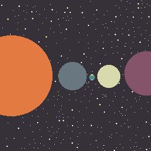

# Ludum-Dare-38
My Entry to LD38 - "Small World" - Dev Log

*{2017-04-22 07:00 GMT+1}*: I'm an old man, getting up at 2am? No thank you! I begin my jam.

*{2017-04-22 07:29 GMT+1}*: I have completed breakfast (granola and yoghurt, see 'Old Man' above.) I have completed my boilerplate using my homegrown WebGL engine [glixl](https://github.com/MalphasWats/glixl).

*{2017-04-22 07:31 GMT+1}*: [Initial Repo Push](https://github.com/MalphasWats/Ludum-Dare-38/tree/gh-pages)!

## Idea

*{2017-04-22 07:39 GMT+1}*: Ok, my idea is that it's a small world, but it's *your* world and it needs defending. Creatures from some *other* place are bleeding through into yours. They're hostile and they eat bio matter. Your lush green world is slowly being consumed. Deploy your forces and protect the world!

*{2017-04-22 07:39 GMT+1}*: Right, so, artwork.

*{2017-04-22 09:03 GMT+1}*: A title screen! And a location:

Art is slow.

## Code

*{2017-04-22 09:56 GMT+1}*: Finally located the bug in my framework - it was trying to push empty uniforms because there aren't any lights defined! Onward!

*{2017-04-22 09:56 GMT+1}*: I have a title scene that when clicked loads a 'test level' of just green tiles. Scene switching works! I also have a scary creature from *somewhere else*:

## Story

*{2017-04-22 14:44 GMT+1}*: I've got some simple UI elements working and I've written the back story. I think I know where I'm going!

<video src="images/intro.mov" controls>
Sorry, your browser doesn't support embedded videos, 
but don't worry, you can <a href="images/intro.mov">download it</a>.
</video>

## Missions

*{2017-04-22 18:09 GMT+1}*: After a bit of a break, I've been working on the mission system - I have a *Scout* unit now! I'm really pleased with the UI work I did earlier.